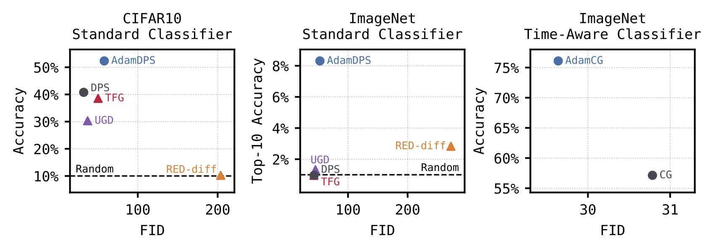

<div align="center">

# Adaptive Moments Are Surprisingly Effective for Plug-and-Play Diffusion Sampling

**Christian Belardi, Justin Lovelace, Kilian Q. Weinberger, Carla P. Gomes**

Cornell University

**ICLR 2026**

[](https://openreview.net/forum?id=qYDObsHldZ)
[](https://arxiv.org/abs/2603.16797)
[](LICENSE)



</div>

Guided diffusion sampling relies on approximating often intractable likelihood scores, which introduces significant noise into the sampling dynamics. We propose using adaptive moment estimation to stabilize these noisy likelihood scores during sampling. Despite its simplicity, our approach achieves state-of-the-art results on image restoration and class-conditional generation tasks, outperforming more complicated methods, which are often computationally more expensive.

## Installation

```bash
conda create -n adam-guidance python=3.9
conda activate adam-guidance
pip install -r requirements.txt
```

## Pretrained Models and Data

This codebase builds on [TFG](https://github.com/YWolfeee/Training-Free-Guidance) and uses the model checkpoints distributed with it — we do not re-host them. Download them from the TFG checkpoint folder ([Google Drive](https://drive.google.com/drive/folders/1fS7dKpO4O-FjaLwuRXuHBxEOlkqMMTGh?usp=sharing)) and place them under `./models/` (configurable via `MODEL_PATH` in `utils/env_utils.py`):

Models hosted on the Hugging Face Hub (e.g. `google/ddpm-ema-cat-256` for the cat restoration tasks, and the ViT/ConvNeXt evaluation classifiers) download automatically, as do the CIFAR-10 and cat datasets. For ImageNet experiments, place the training split at `./data/imagenet-1k/train` (configurable via `IMAGENET_PATH` in `utils/env_utils.py`).

## Quick Start

Class-conditional CIFAR-10 generation with Adam-DPS, using the paper's tuned hyperparameters for this task:

```bash
python main.py --data_type image --dataset cifar10 --task label_guidance \
  --image_size 32 --model_name_or_path openai_cifar10.pt \
  --guide_network resnet_cifar10.pt --target 8 \
  --guidance_name adam_dps --guidance_strength 0.034 --beta1 0.0 --beta2 0.817 \
  --inference_steps 100 --eta 1.0 --num_samples 64 --per_sample_batch_size 32 \
  --seed 42 --logging_dir logs
```

Ready-made examples for each task are in `scripts/`. Generated samples (`.npy`/`.png`) and evaluation metrics (`metrics.json`) are written under a hierarchical directory beneath `--logging_dir`.

## Guidance Methods

Selected via `--guidance_name`:

| Base method | Adam variant | Description |
|---|---|---|
| `dps` | `adam_dps` | Diffusion Posterior Sampling |
| `cg` | `adam_cg` | Classifier Guidance |
| `mpgd` | `adam_mpgd` | Manifold-Preserving Guided Diffusion |
| `pigdm` | `adam_pigdm` | Pseudoinverse-Guided Diffusion |
| `ugd`, `tfg`, `lgd_<N>`, `reddiff` | — | Baselines for comparison (`lgd_<N>` uses N Monte-Carlo samples, e.g. `lgd_10`) |
| `no` | — | Unconditional (no guidance) |

The `adam_*` variants apply adaptive moment estimation to the corresponding method's guidance gradient.

## Tasks

Selected via `--task`:

- **Class-conditional generation**: `label_guidance`, `label_guidance_time`
- **Super-resolution**: `super_resolution` (and harder `super_resolution_8` / `_12` / `_16`)
- **Gaussian deblur**: `gaussian_deblur` (and harder `gaussian_deblur_6` / `_9` / `_12`)
- **Inpainting**: `inpainting`

Combine tasks with `+`, e.g. `--task "super_resolution+inpainting"` with matching `--guide_network` and `--target`. (Note: the bundled classifier-accuracy evaluator assumes a single guide network.)

## Hyperparameter Tuning

Bayesian optimization over guidance hyperparameters:

```bash
# Search
python tune.py --config tuning/configs/cifar10.yaml --task label_guidance \
  --guidance_name adam_dps --iter_steps 1 --n_sobol 50 --n_total 150

# Evaluate the best configuration found
python test.py --config tuning/configs/cifar10.yaml --task label_guidance \
  --guidance_name adam_dps --iter_steps 1
```

Per-dataset configs live in `tuning/configs/` (CIFAR-10, cat, ImageNet; `*_ddim.yaml` variants for the DDIM ablations). `test.py` reads the best hyperparameters from the search output directory; pass `--output_root <dir>` to write its samples and metrics under a separate directory.

### Reproducing the Paper's Results

The search outputs behind the paper's tables ship with this repo: `paper-results/hyperparameter-search/` (and `paper-results-ddim/hyperparameter-search/` for the DDIM ablation) contain the full 150-trial search history (`search_50_150.csv`) for every experiment supported by the released code. Point `test.py` at them with `--search_root` to rerun any experiment's best configuration:

```bash
python test.py --config tuning/configs/cifar10.yaml --task label_guidance \
  --guidance_name adam_dps --iter_steps 1 --num_samples 2048 \
  --search_root paper-results/hyperparameter-search --output_root my-results
```

For the ablations, pass `--override_inference_steps {12,25,50,250}` to use the corresponding step-count searches, and pair the `*_ddim.yaml` configs with `--search_root paper-results-ddim/hyperparameter-search` for the DDIM runs.

## Citation

```bibtex
@inproceedings{
belardi2026adaptive,
title={Adaptive Moments are Surprisingly Effective for Plug-and-Play Diffusion Sampling},
author={Christian Belardi and Justin Lovelace and Kilian Q Weinberger and Carla P Gomes},
booktitle={The Fourteenth International Conference on Learning Representations},
year={2026},
url={https://openreview.net/forum?id=qYDObsHldZ}
}
```
